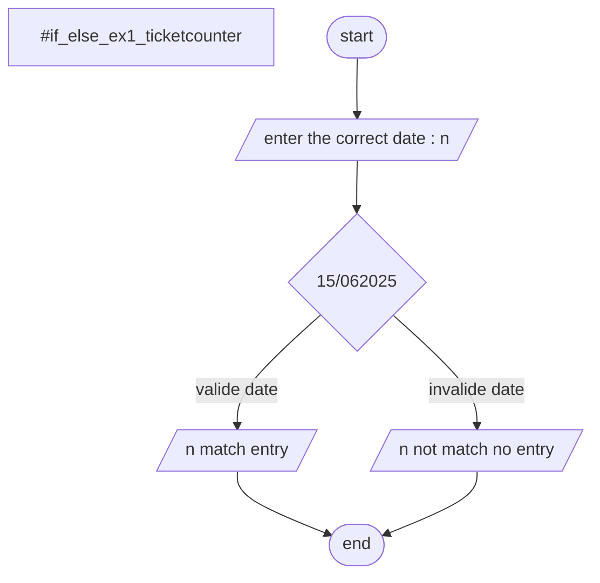
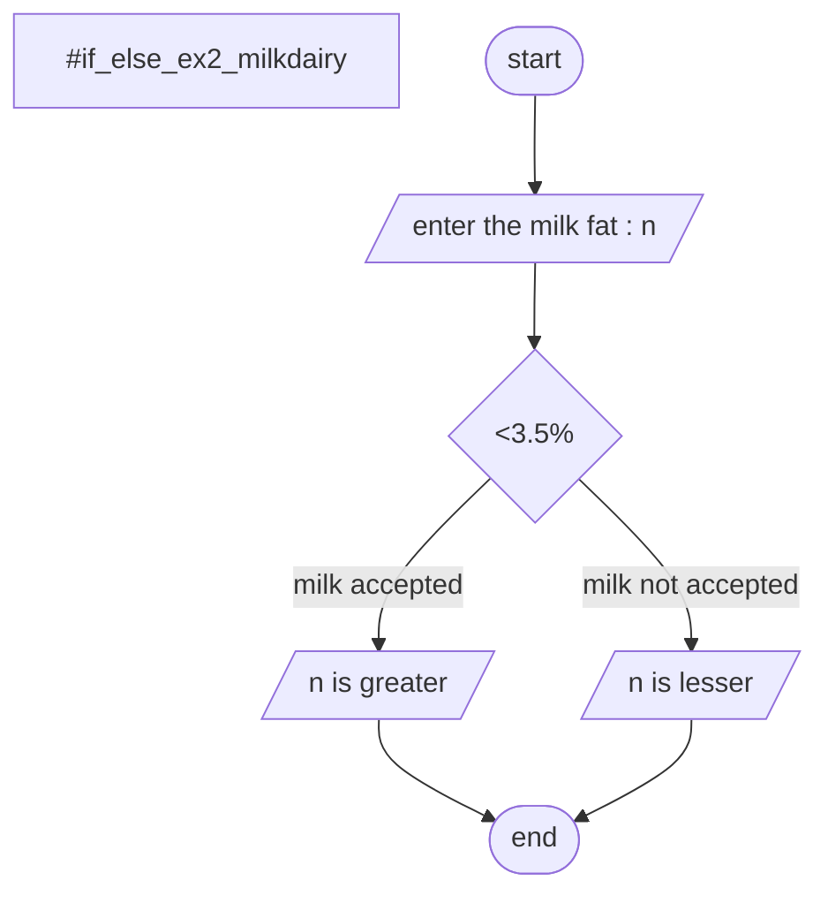
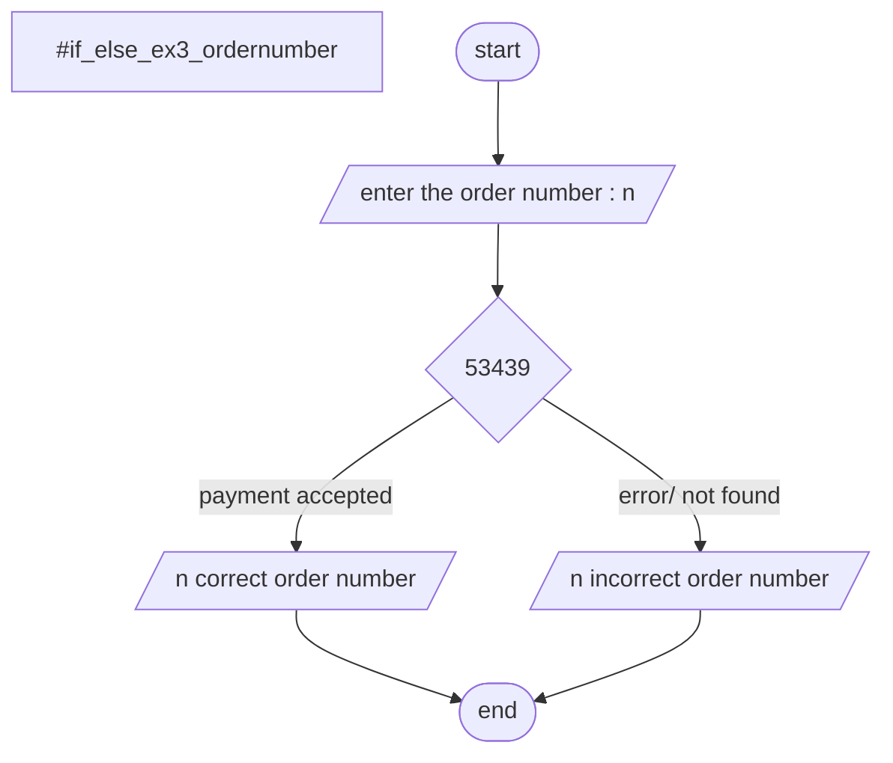
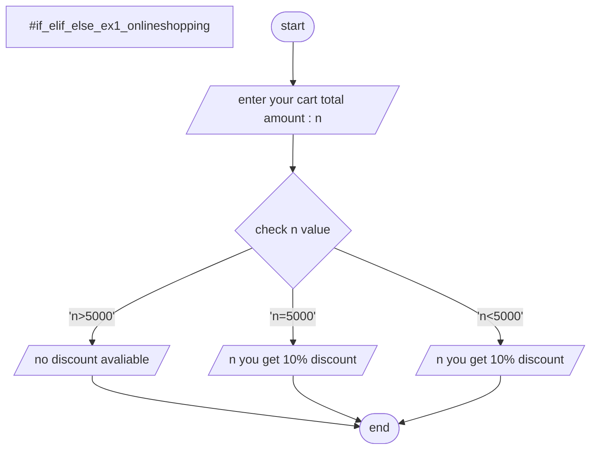
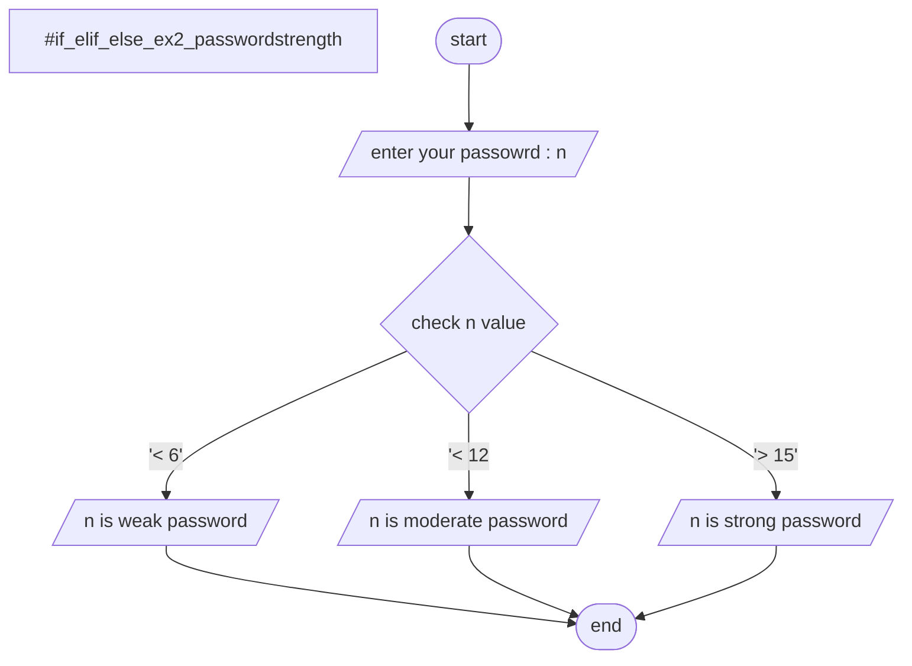
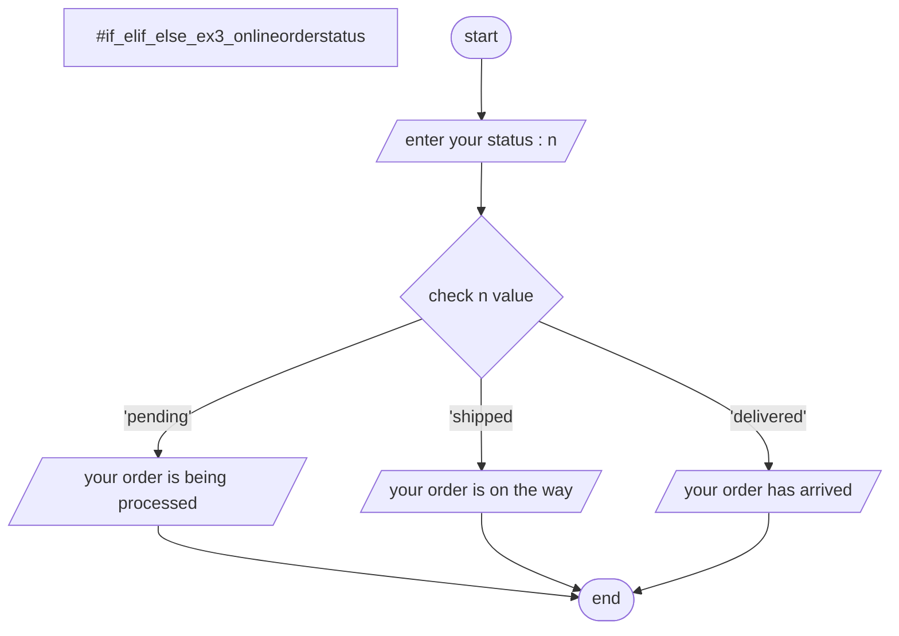
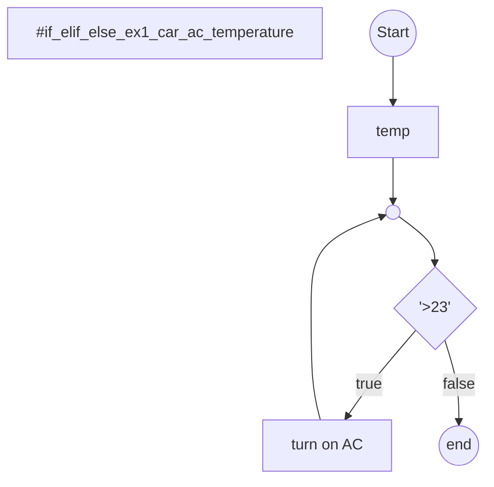
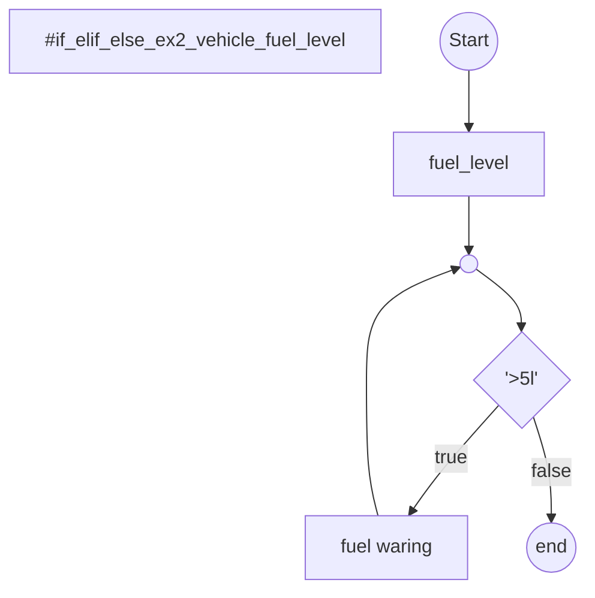
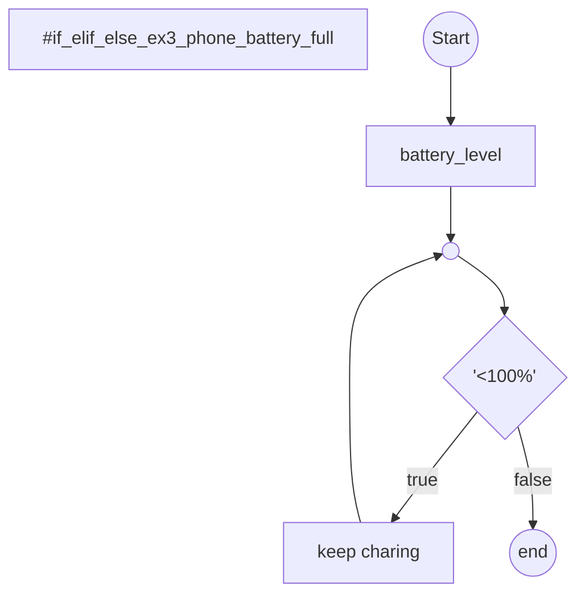

```mermaid
flowchart
#if_else_ex1_ticketcounter

    s([start])
    n[/enter the correct date : n /]
    c{ 15/062025 }
    o1[/ n not match no entry /]
    o[/ n match entry /]
    e([end])

    s --> n
    n --> c
    c --valide date--> o
    c --invalide date--> o1
    o --> e
    o1 --> e

```

```mermaid
flowchart
#if_else_ex2_milkdairy

    s([start])
    n[/enter the milk fat : n /]
    c{ <3.5% }
    o1[/ n is lesser /]
    o[/ n is greater /]
    e([end])

    s --> n
    n --> c
    c --milk accepted--> o
    c --milk not accepted--> o1
    o --> e
    o1 --> e

```

```mermaid
flowchart
#if_else_ex3_ordernumber

    s([start])
    n[/enter the order number : n /]
    c{ 53439 }
    o1[/ n incorrect order number /]
    o[/ n correct order number /]
    e([end])

    s --> n
    n --> c
    c --payment accepted--> o
    c --error/ not found--> o1
    o --> e
    o1 --> e

```

```mermaid
flowchart
#if_elif_else_ex1_onlineshopping

    s([start])
    n[/enter your cart total amount : n /]
    c{ check n value }
    o1[/ n you get 10% discount /]
    o2[/ no discount avaliable /]
    o3[/ n you get 10% discount /]
    e([end])

    s --> n
    n --> c
    c --'n>5000'--> o2
    c --'n=5000'--> o3
    c -- 'n<5000'--> o1
    o2 --> e
    o3 --> e
    o1 --> e

```

```mermaid
flowchart
#if_elif_else_ex2_passwordstrength

    s([start])
    n[/enter your passowrd : n /]
    c{ check n value }
    o1[/ n is strong password /]
    o2[/ n is weak password /]
    o3[/ n is moderate password /]
    e([end])

    s --> n
    n --> c
    c --'< 6'--> o2
    c --'< 12--> o3
    c -- '> 15'--> o1
    o2 --> e
    o3 --> e
    o1 --> e

```

```mermaid
flowchart
#if_elif_else_ex3_onlineorderstatus

    s([start])
    n[/enter your status : n /]
    c{ check n value }
    o1[/ your order has arrived /]
    o2[/ your order is being processed /]
    o3[/ your order is on the way /]
    e([end])

    s --> n
    n --> c
    c --'pending'--> o2
    c --'shipped--> o3
    c -- 'delivered'--> o1
    o2 --> e
    o3 --> e
    o1 --> e

```

```mermaid
flowchart
#if_elif_else_ex1_car_ac_temperature

    start(( Start )) --> temp
    temp --> a(( ))
    a(( )) --> con{ '>23' }
    con --> | true | s[turn on AC]
    s --> a
    con --> | false | e((end))

```

```mermaid
flowchart
#if_elif_else_ex2_vehicle_fuel_level

    start(( Start )) --> fuel_level
    fuel_level --> a(( ))
    a(( )) --> con{ '>5l' }
    con --> | true | s[fuel waring]
    s --> a
    con --> | false | e((end))

```

```mermaid
flowchart
#if_elif_else_ex3_phone_battery_full

    start(( Start )) --> battery_level
    battery_level --> a(( ))
    a(( )) --> con{ '<100%' }
    con --> | true | s[keep charing]
    s --> a
    con --> | false | e((end))

```
